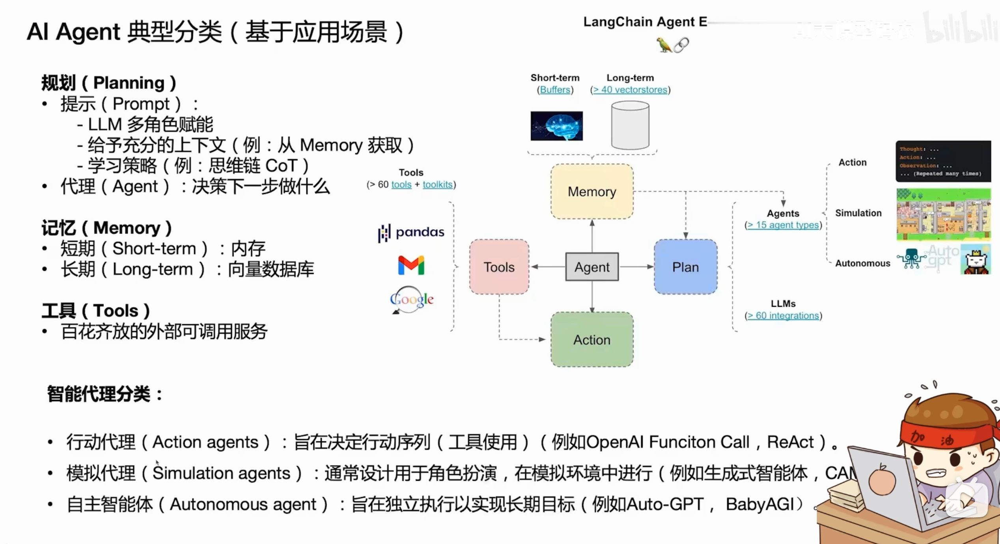
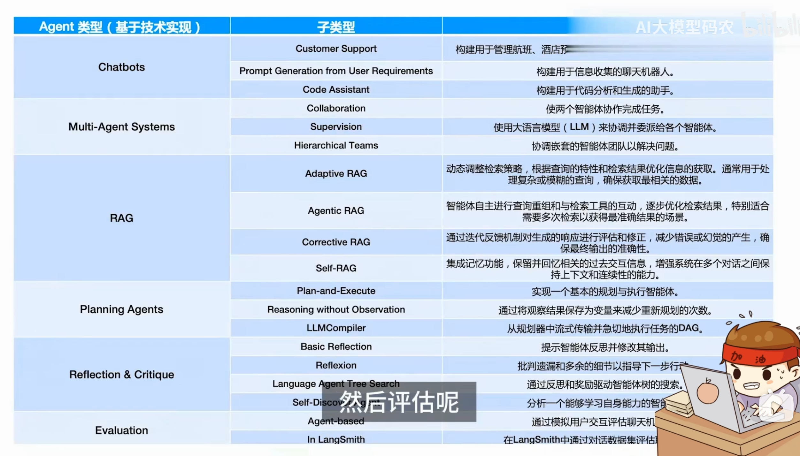
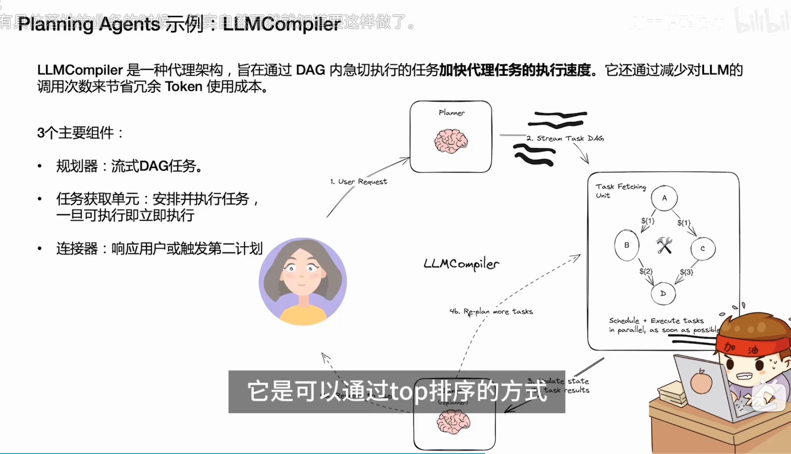
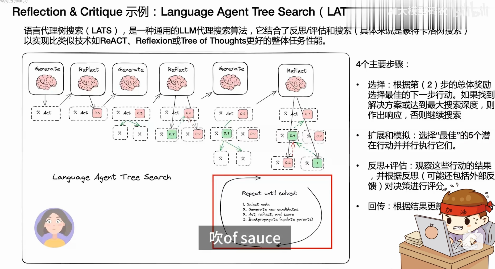
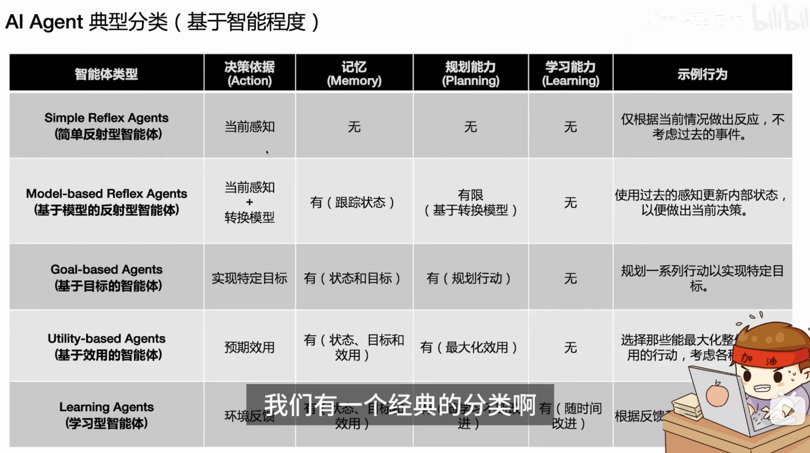

# Agent方法论 07：Agent 开发典型范式

> 来源：[原始内容](https://www.bilibili.com/video/BV1xwVr6FEh4?p=8)
> 整理日期：2026-09-04

> 本笔记对应视频第 8 分P：**【Agent方法论】07.Agent开发典型范式**
>
> - 视频：[B站 BV1xwVr6FEh4?p=8](https://www.bilibili.com/video/BV1xwVr6FEh4?p=8)
> - UP 主：AI大模型码农
> - 视频时长：约 55 分 50 秒
> - 整理范围：只整理本分P，未展开同合集其他分P
> - 字幕副产物：[第 8 分P字幕与时间轴](https://www.bilibili.com/video/BV1xwVr6FEh4?p=8)

## 这集讲什么

这集不是在讲某一个 Agent 框架的 API，而是在回答一个更基础的问题：**Agent 可以从哪些维度分类？不同类型的 Agent 到底多了什么能力？**

视频给出了三条互补的观察轴：

1. **按应用场景分类**：它要完成什么类型的工作？
2. **按技术实现分类**：它用了什么工程结构或研究范式？
3. **按智能程度分类**：它具备决策、记忆、规划、学习中的哪些能力？

这三条轴不是互斥关系。同一个 Agent 可以同时是“面向查询的 Action Agent”“基于 RAG 的 Chatbot”，并且在能力上处于“基于模型的反射代理”或“目标型代理”阶段。

## 一、先建立总框架：Agent 是一组能力的组合

我的截图笔记里把 Agent 的基础组件归纳为：**Plan、Memory、Tools、Action**，再由大模型负责理解、决策和协调。



可以把它理解成下面这条链路：

```text
用户目标 / 当前环境
        ↓
大模型理解上下文，决定下一步
        ↓
读取记忆 ── 调用工具 ── 执行动作
        ↓
观察结果，继续规划或结束
```

视频真正强调的不是“组件越多越智能”，而是：**不同任务需要不同的能力组合**。只做天气查询的 Agent 不需要复杂的长期记忆；需要跨多个步骤完成目标的 Agent，才需要规划、状态追踪、工具编排和终止机制。

## 二、按应用场景分类：Action、Simulation、Autonomous

### 1. Action Agent：为一个明确任务调用工具

**核心特征**：功能相对单一，接收用户请求后，通过工具完成一个特定动作。

视频举的例子包括天气查询、生成图形、智能家居控制等。它的重点不是“自己长期生活”，而是把自然语言请求转换为可执行的工具调用。

### 2. 一个典型落地：自然语言转 SQL

视频用数据库查询说明 Action Agent 的价值：

```text
用户问题：查询歌曲数量最多的 Top 5 音乐人
        ↓
Agent 读取数据库 schema
        ↓
理解表、列及其含义
        ↓
动态生成 SQL
        ↓
调用数据库工具并返回结果
```

传统做法是程序员为每一种查询需求分别写接口、SQL 或 CRUD 逻辑；Action Agent 则可以根据 schema 动态生成 SQL，再调用查询接口。

但这个方案有一个前提：**数据库 schema 和命名要足够规范**。视频特别提醒，表结构和命名不规范会显著降低 NL2SQL 的可靠性。对新项目而言，可以在设计表结构时就让大模型参与，先把表、列和关系定义清楚；对历史系统而言，则需要增加 schema 描述、字段别名、SQL 校验和权限控制。

> **整理理解**：Action Agent 的能力上限，往往不是模型会不会生成 SQL，而是工具描述、schema 质量、权限边界和执行结果校验是否可靠。

### 3. Simulation Agent：在沙盒中扮演角色

Simulation Agent 的重点是**角色扮演和环境交互**。视频以斯坦福 Generative Agents / 虚拟小镇为例：把多个智能体放进一个沙盒环境，让它们拥有各自的角色、记忆和行为，并在环境变化后相互交流。

视频提到的典型现象是：当上帝视角在小镇里设置“某个房子着火”后，其他 Agent 观察到环境变化，可能暂停原来的活动并前往救火或寻找解决办法。

这类 Agent 更适合：

- 游戏中的 NPC 行为模拟；
- 剧本、社会互动或城市运行模拟；
- 研究多角色协作和涌现行为。

它和 Action Agent 的区别是：Action Agent 主要关心“把一个动作做完”，Simulation Agent 关心“角色在环境中如何持续行动和互动”。

### 4. Autonomous Agent：围绕长期目标自主执行

Autonomous Agent 的目标更长远，代表例子是 AutoGPT、BabyAGI 一类系统。视频的判断很明确：这类系统理念很有吸引力，但早期模型的理解能力、规划能力和工具调用能力还不足，因此容易出现任务跑偏、死循环或无法收敛的问题。

AutoGPT 类实现背后通常包含：

- 大模型：负责理解目标、生成下一步决策；
- Tools：搜索、读文件、写文件等外部能力；
- Memory：保存历史信息，常见实现包括向量数据库；
- Prompt：规定角色、目标、可用命令、输出格式和结束条件。

视频展示的一个关键设计是 `finish` command：当任务完成后，Agent 必须显式调用结束命令。如果没有这个终止机制，模型可能持续生成中间思考并反复调用，造成死循环和额外 Token 消耗。

视频还强调了几类 Prompt 约束：

1. 明确角色和任务目标；
2. 明确可用的 command / tool；
3. 把 `finish` 放在醒目位置，规定何时结束；
4. 规定返回格式，例如 JSON；
5. 提供格式示例，让模型更容易稳定输出；
6. 必要时要求结果可以被程序解析，例如 Python `json.loads`。

视频中的示例流程是：Agent 使用搜索工具查询资料，再用写文件工具把结果保存到 TXT 文件，最后通过 `finish` 结束任务。

> **实践建议**：任何“自主循环”都应该同时设计最大步数、超时、Token 预算、工具白名单、失败重试次数和人工接管入口。仅依赖 `finish` 还不够。

## 三、按技术实现分类：六类常见范式

用户截图中记录的技术实现分类如下：



| 技术范式 | 常见子类型 | 解决的问题 |
|---|---|---|
| Chatbots | Customer Support、Code Assistant | 面向对话、客服或代码协助 |
| Multi-Agent Systems | Collaboration、Supervision、Hierarchical Teams | 让多个 Agent 协作、监督或分层解决问题 |
| RAG | Adaptive RAG、Agentic RAG、Corrective RAG、Self-RAG | 让回答基于外部知识，并能处理召回不足或结果不可靠 |
| Planning Agents | Plan-and-Execute、Reasoning without Observation、LLMCompiler | 把复杂目标拆成任务并安排执行 |
| Reflection & Critique | Basic Reflection、Reflexion、LATS | 对结果进行反思、评估和搜索改进 |
| Evaluation | Agent-based、In LangSmith | 评估 Agent 的回答、轨迹和整体效果 |

视频只对其中若干代表范式展开，重点不是记住名称，而是理解它们各自增加了什么结构。

## 四、几个关键技术范式

### 1. RAG 不只有“召回后生成”

视频把 RAG 看成一组围绕检索质量进行控制的 Agent 范式。它们共同解决一个问题：**检索结果不一定总是相关、完整或足够可信**。

#### Corrective RAG / CRAG：检索后评分，不够好就纠正

典型流程：

```text
用户问题
  ↓
检索知识库
  ↓
对召回结果评分
  ├─ 结果质量足够：继续生成
  └─ 质量不足：移除低质量结果
                    ↓
              重写 Query / Web Search
                    ↓
              必要时把新知识加入知识库
```

视频指出，固定的检索算法和固定阈值很容易出现两种极端：结果太多，或者完全没有召回。CRAG 可以引入评分函数，对不同问题动态判断阈值；当本地知识库没有答案时，还可以重写问题并使用 Web Search 兜底。

#### Self-RAG：让生成结果接受自我评估

Self-RAG 的思路是：模型不只是把检索结果润色后直接回答，而是对结果进行反思和评分，过滤掉不相关、低质量或可能导致幻觉的内容；如果判断不满足要求，则重新改写问题并走一轮流程。

> **两者的关键区别**：CRAG 更强调“检索结果的纠正和外部兜底”；Self-RAG 更强调“生成过程中的自我反思与质量控制”。实际系统可以组合使用。

### 2. LLMCompiler：把任务组织成 DAG 并尽量并行

LLMCompiler 用编译器式的思路处理复杂任务：先把用户目标拆成多个子任务，再用有向无环图（DAG）表示任务之间的依赖关系，最后按依赖顺序调度执行。



用户截图里记录的三个核心组件可以理解为：

- **Planner**：把用户请求规划成流式 DAG 任务；
- **Task Fetching Unit**：获取已经满足依赖、可以执行的任务，并立即调度；
- **Joiner / Connector**：根据用户反馈或执行结果触发重新规划。

如果两个任务互不依赖，就可以并行执行；如果存在先后依赖，就按拓扑顺序执行。DAG 边上的耗时或代价还可以帮助定位关键路径，把优化资源优先放到最耗时的任务上。

> **工程化理解**：LLMCompiler 的价值不只是“让模型拆任务”，更在于把拆出的任务变成可观测、可调度、可并行和可重新规划的执行图。

### 3. LATS：把搜索、反思和评估结合起来

LATS（Language Agent Tree Search）可以看作把 Tree of Thoughts 一类搜索思想工程化为 Agent 搜索流程。用户截图记录的四步是：



1. **选择**：根据当前累计奖励或评分，选择最有希望的下一步；
2. **扩展与模拟**：生成多个候选动作，并尝试执行或模拟；
3. **反思与评估**：观察结果，根据外部反馈或模型判断进行评分；
4. **回传**：把结果更新回搜索树，影响后续选择。

与早期需要手工定义状态生成函数、评估函数的 Tree of Thoughts 做法相比，LATS 更依赖大模型完成候选生成、选择和反思，减少了人工穷举解空间的工作。

### 4. Multi-Agent：让不同 Agent 成为不同领域的专家

视频用一个很直观的类比解释 Multi-Agent：一个人可以学习多种能力，但一个由前端、后端、产品经理组成的团队，往往能比单个人更快完成复杂项目。

一个最小的多 Agent 结构可以是：

```text
用户请求
   ↓
Router / Supervisor
   ├─ Researcher：搜索和整理资料
   └─ Chart Generator：生成图表或可视化
```

每个 Agent 都有自己的角色、提示词和工具，通过 `call` 方法执行任务；Router 或 Supervisor 根据请求决定调用谁。视频强调了三点：

- Agent 的职责尽可能不重合，否则路由器很难判断该交给谁；
- Supervisor 通常需要更强的模型或更好的 Prompt 来做决策；
- 如果被调度的 Agent 自身还具备工具能力，多 Agent 的价值会比单纯的“文本路由”更大。

当 Agent 数量增加时，可以继续引入层级团队：上层 Supervisor 管理若干领域 Agent，领域 Agent 再调用工具或下属 Agent。

## 五、按智能程度分类：能力逐级增加

我的截图笔记将这一维度整理成五类：



| 类型 | 决策依据 | 记忆 | 规划 | 学习 | 典型行为 |
|---|---|---|---|---|---|
| Simple Reflex Agent 简单反射代理 | 当前感知 | 无 | 无 | 无 | 根据当前条件直接执行动作 |
| Model-based Reflex Agent 基于模型的反射代理 | 当前感知 + 内部模型 | 有，跟踪状态 | 有限 | 无 | 用历史状态更新内部状态后决策 |
| Goal-based Agent 目标型代理 | 为实现目标选择动作 | 有 | 有，考虑行动序列 | 无 | 规划一系列动作完成目标 |
| Utility-based Agent 效用型代理 | 预期效用 | 有状态、目标和效用 | 有，选择更优方案 | 无 | 比较多个动作，选择更能达成目标的方案 |
| Learning Agent 学习型代理 | 环境反馈 | 有 | 可持续改进 | 有 | 根据反馈更新策略、知识或 Agent 设计 |

### 1. Simple Reflex Agent：条件—动作规则

它最接近传统的 `if-else` 或 Function Calling：感知到某个条件，就执行对应动作。例如检测到房间有灰尘，就调用清洁动作。

它不需要记住过去，也不根据长历史规划，只依赖当前输入和条件动作规则。一个应用里可以放多个这样的 Agent，也可以把多条规则集中在一个 Agent 中。

### 2. Model-based Reflex Agent：维护内部状态

它比简单反射多了一个“内部状态”：不仅看当前传感器数据，还会把过去的聊天记录、Action 反馈或 Observation 保存到内存、向量数据库等位置，再与新输入一起作为决策依据。

这一步的本质是：Agent 开始拥有“环境现在是什么状态”的内部模型，而不再每次都从零开始判断。

### 3. Goal-based Agent：围绕目标做规划

当 Agent 不再是“一问一答后结束”，而是要经过多个步骤达成目标，就需要目标和规划。

它可能要考虑：

- 目标是什么；
- 当前状态是什么；
- 哪些行动可以推进目标；
- 不同行动之间的先后关系；
- 什么时候算完成。

视频将 AutoGPT 看作这类目标型 Agent 的重要启发来源，但也指出：长序列规划越复杂，越需要限制条件、搜索策略和终止机制。

### 4. Utility-based Agent：不仅要完成，还要尽量做好

目标型 Agent 只回答“能不能完成目标”；效用型 Agent 还要回答“哪种完成方式更好”。

它会为候选行动引入效用函数或评估规则，比较不同动作产生的结果，再选择预期收益更高的动作。视频把反思、评估等机制也视为效用判断的一种实现方式：形式上可能是函数，也可能是一组规则。

### 5. Learning Agent：从反馈中持续改进

学习型 Agent 在前四类能力之外增加了持续学习机制。视频认为它仍处于较早期阶段，核心不一定是每次都重新训练基础模型，也可以通过以下方式迭代：

- 根据用户反馈更新 Agent 的策略；
- 更新知识库和历史经验；
- 由评论员 / 评估器发现问题；
- 由问题生成器构造新的训练或改进目标；
- 下次遇到类似问题时复用最佳实践。

因此，“学习”不等于“模型参数立刻更新”。在工程系统中，先迭代 Prompt、工具描述、知识库、路由规则和评估集，往往更现实。

## 六、把三种分类方法串起来

用户截图笔记里还记录了一个很重要的提醒：**按场景、按技术、按智能程度是在描述同一个 Agent 的不同侧面**。

例如，一个“自然语言查数据库”的系统可以这样描述：

| 观察维度 | 描述 |
|---|---|
| 应用场景 | Action Agent：接收问题，调用数据库工具完成查询 |
| 技术实现 | Chatbot + Tool Calling；也可以叠加 RAG 读取 schema 文档 |
| 智能程度 | 至少是 Simple Reflex；如果维护历史状态并分解复杂查询，可向 Model-based / Goal-based 演进 |

再比如，一个“自动研究并生成报告”的系统：

| 观察维度 | 描述 |
|---|---|
| 应用场景 | Autonomous Agent，围绕长期目标执行 |
| 技术实现 | Planner + Tools + Memory + Multi-Agent + Evaluation |
| 智能程度 | 目标型或效用型；如果能根据反馈更新知识和策略，可进一步接近 Learning Agent |

这样分类的好处是，不会把“用了 RAG”误认为“已经是高智能 Agent”，也不会把“多 Agent”误认为“每个 Agent 都具备自主规划能力”。**技术组件、应用形态和智能水平是三件不同的事。**

## 七、这集最值得记住的结论

1. **先按任务选 Agent 形态，不要一上来追求完全自主。** 能用一个受控的 Action Agent 解决，就不要无必要地引入长循环。
2. **工具调用是 Agent 落地的关键连接层。** 模型负责理解和决策，工具负责把决策变成真实动作。
3. **自主 Agent 必须有终止条件和预算边界。** `finish`、最大步数、超时、重试上限和人工接管都属于基础设计。
4. **RAG 的重点不只是召回，而是处理召回失败和结果不可靠。** CRAG、Self-RAG 代表了纠正、评分和反思方向。
5. **规划的工程价值在于可拆解、可并行、可观测、可重规划。** LLMCompiler 用 DAG 把这些能力组织起来。
6. **多 Agent 的核心不是数量，而是职责边界。** 角色要尽量互补且不重合，Router / Supervisor 才有清晰的调度依据。
7. **智能程度可以看作能力逐层增加：** 当前规则 → 内部状态 → 目标规划 → 效用评估 → 根据反馈学习。
8. **Agent 的核心能力不随分类方式改变。** 分类只是观察角度，最终仍要回到 Plan、Memory、Tools、Action、Evaluation 等基础能力。

## 复习时可以自测

- 一个只负责查天气并调用天气 API 的系统，为什么属于 Action Agent？
- 如果数据库查询 Agent 生成了错误 SQL，应该在哪些层增加校验？
- CRAG 与 Self-RAG 分别在 RAG 流程的哪个位置介入？
- LLMCompiler 为什么适合用 DAG 表示，而不是简单的线性步骤？
- 一个 Multi-Agent 系统为什么要尽量避免 Agent 职责重叠？
- 从 Simple Reflex 演进到 Utility-based，新增的核心能力分别是什么？

## 相关截图笔记

- [Agent 典型范式 速记.md](Agent%20典型范式%20速记.md)：本次整理使用的个人截图笔记。
- 截图目录：`assets/`

## 副产物导航

副产物（原始字幕、时间轴转录、元数据）仅存本地，不进公开仓库。来源：[https://www.bilibili.com/video/BV1xwVr6FEh4?p=8](https://www.bilibili.com/video/BV1xwVr6FEh4?p=8)
