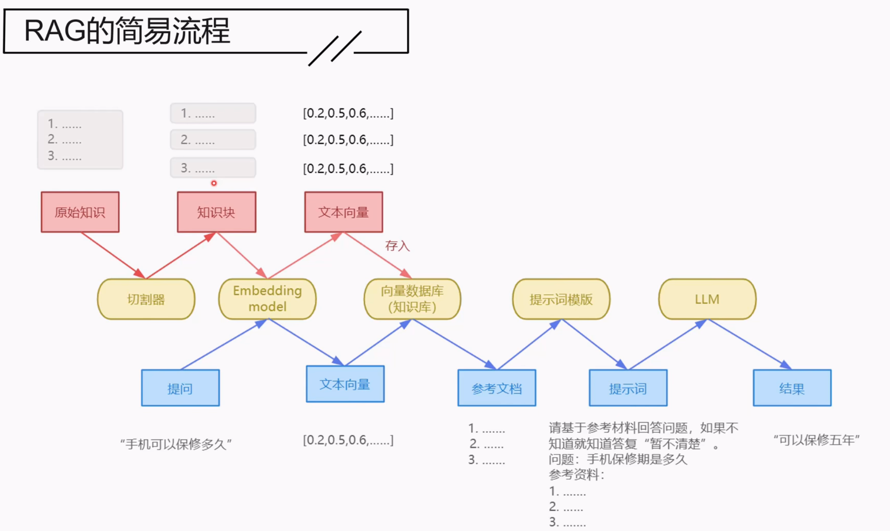
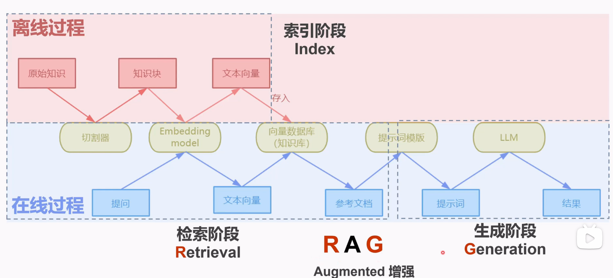
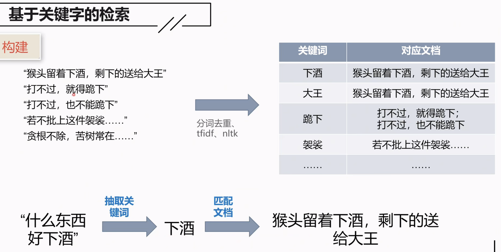
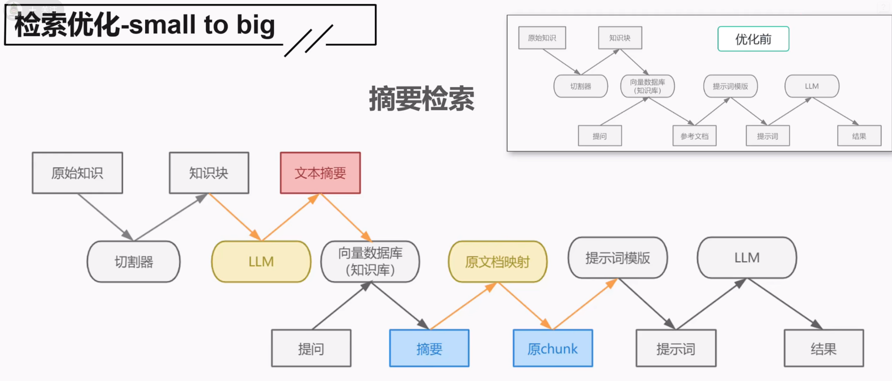
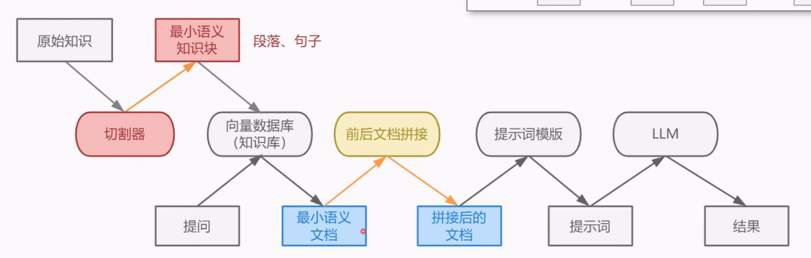
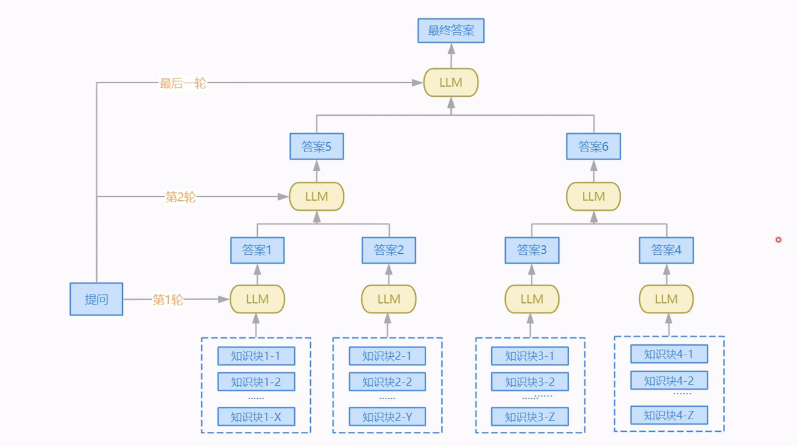
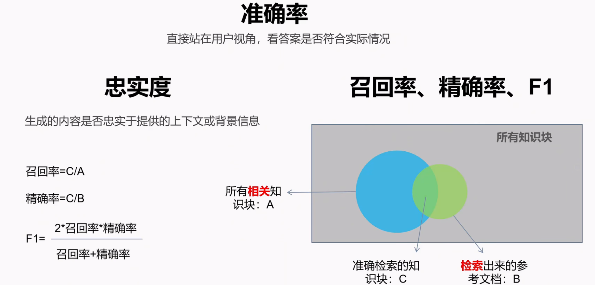
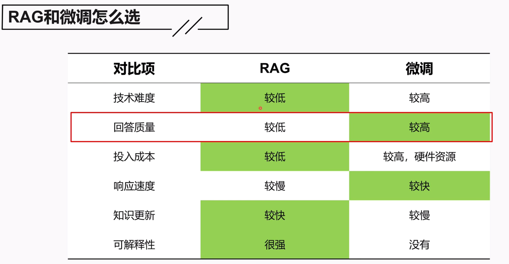
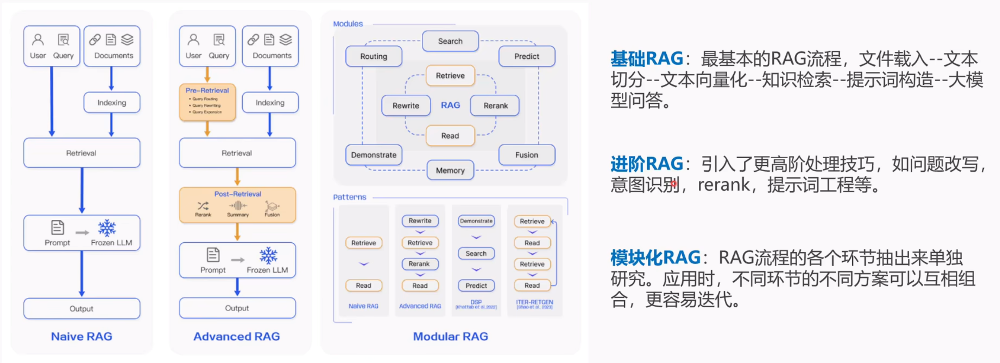

# 【RAG-全集】最适合新手的大模型RAG入门课程｜学习笔记
> 来源：[原始内容](<https://www.bilibili.com/video/BV1hj5DzyE5d/>)
> 整理日期：2026-08-31

> 基于 BibiGPT ASR 字幕（906 条 cue，覆盖 00:15–01:09:51）精校，参考本人观看笔记 本地观看笔记 与 10 张关键截图。

## 视频速览

- **标题**：【RAG-全集】最适合新手的大模型RAG入门课程（大佬勿扰啦）
- **作者**：费曼学徒冬瓜
- **时长**：01:10:02（4202 秒）
- **BV 号**：BV1hj5DzyE5d（[B 站原视频](https://www.bilibili.com/video/BV1hj5DzyE5d/)）
- **定位**：新手向 RAG 入门，覆盖基础流程、检索/生成优化、评估、RAG vs 微调、模块化 RAG

## 一句话结论

**RAG = 检索 + 生成**：先从知识库检索出相关参考内容，再让大模型基于这些内容回答，从而解决大模型"无法回答私域问题"的缺陷。课程金句——**"上手只要一星期，上线要一年"**：基础流程一周能跑通，但真正的工程优化点极多，这才是 RAG 的难点。

## 课程主线

视频分两大部分：**基础 RAG 流程**（索引→检索→生成）和 **优化方案**（检索优化 5 种 + 生成优化 + 提问改写 + 元数据），最后讲**评估**、**RAG vs 微调**和**模块化 RAG**，并站在项目经理视角给出落地建议。

---

# 第一部分：RAG 基础

## 1. RAG 是什么、为什么用

- **核心动机**：大模型（LLM）的三大缺陷——幻觉、知识更新不及时、**无法回答私域问题**。其中作者认为最关键的是第三条：大模型的知识来自公开互联网训练数据，企业内部数据没被训练过，所以回答不了。
- **私域问题**：答案藏在你企业内部的问题（客服政策、产品手册、内部流程等）。
- **举例**：问大模型"按照费曼学徒公司的客服政策，投诉用户能送多少优惠券"——它答不了，因为政策存在企业内部。
- **RAG 的思路**：把参考材料给它。第一次直接问→答不出；第二次附上参考材料（"公司提供 300~6000 优惠券"）→ 答出来了。
- **RAG 定义**：根据给定问题，从知识库检索合适的参考内容，再让大模型基于内容回答。
- **典型应用**：AI 客服（政策查询）、AI 搜索引擎（如 Kimi——懂的时候不搜，不懂才搜）。
- **三个核心**：**知识库、检索、回答**。

## 2. RAG 简易流程与三阶段

- **离线（红色，知识库准备）**：文档 → 切割器切分 → 知识块 → 转成向量 → 存入数据库
- **在线（蓝色，提问）**：问题 → 转成向量 → 检索最匹配参考文档 → 和问题一起输入提示词模板 → 大模型 → 结果
- **三阶段**：索引（Index，离线建库）→ 检索（Retrieval，在线找文档）→ 生成（Generation，在线生成答案）
- **R-A-G 拆解**：R = 检索，G = 生成，A = 增强（用检索到的内容增强生成）。

*RAG 简易流程：离线建库 + 在线检索生成*

*RAG = 索引（离线）+ 检索（在线）+ 生成（在线）*

## 3. 知识收集

在切分之前，先按应用场景收集知识：

- **按场景收集**：做产品 AI 客服就收产品资料，别把公司规章制度也塞进来。
- **关注存储位置**：知识存在 word / pdf / 数据库里，处理方式不同。**PDF 是难点**（本质存的是图片，可能要 OCR）。
- **关注格式**：文字、表格、图片、视频。涉及图片/视频就要考虑**多模态**。
- **清洗**：抽取后做清洗。作者观点：大模型容错性高，建设时"先粗后精"即可。

## 4. 文档切分（chunking）

- **核心原则**：**保障语义连贯性**——划分后的文本块语义要统一、完整。
  - 太长 → 一个块里混多种语义，影响检索效果
  - 太短 → 语义不完整，影响回答质量
- **四种切分方法**（语义连贯性从上到下递增，实现复杂度也递增）：

| 方法     | 做法              | 特点              |
| ------ | --------------- | --------------- |
| 固定大小切分 | 按字符数 / token 数切 | 最简单，但会切碎句子，效果最差 |
| 按标点符号切 | 按句子 / 换行符切      | 保证完整句子不被切开，稍好   |
| 按文档结构切 | 按标题 / 章节切       | 利用文档潜在语义结构      |
| 按语义切   | 先按句子，再按相关性整合    | 语义独立 + 完整，最优    |

- **特殊场景**：如果你本来就有丰富的 QA 对（问题-答案对），问题天然就是切好的知识块，**连切分都省了**。

## 5. 文本向量：稀疏 vs 稠密

- **为什么转向量**：计算机只能处理数字，文字必须转成数字向量。
- **方法演变**：
  1. **去重词袋法（独热编码）**：把所有词去重当表头，文本里出现该词标 1，否则标 0。"去重"指只管有没有、不管有多少（"大王"出现两次也只标一次）。
  2. 不去重词袋法：统计词频。
  3. **TF-IDF**：用公式计算权重，更复杂。
  4. **词嵌入（embedding）**：现代方法 → **稠密向量**。
- **稀疏向量**：向量里大部分是 0，只有少数有值。缺点：维度随词汇量爆炸（三国演义能摘出上万个词），需要特定数据结构。
- **稠密向量（词嵌入）**：维度固定（512/768/1024，训练时定死），不再对应具体词。
  - **优点**：捕捉语义相关性极好——"快乐≈高兴"是同义、"北京之于中国 = 巴黎之于法国"这种类比关系。
- **训练 vs 应用**：训练阶段输入海量语料得到 embedding model；应用阶段文本输入模型得向量。应用者只需关注**怎么选模型**（建议去 HuggingFace 按"检索/中文"筛选）。

*稀疏向量 vs 稠密向量对比*

## 6. 向量数据库

- **三大作用**：嵌入文本（指定向量模型后自动完成）、存储向量、相似度分析。
- **常见选型**：Google 向量数据库、FAISS 等。

## 7. 检索：相似度 + 关键词

### 7.1 基于文本相似度

- 把问题转成向量，和知识块向量算相似度。
- **余弦相似度**：用夹角表示，0°~180°，夹角越大相似度越小。
- **欧式距离**：距离越小相关性越高。
- 计算示例：a=(1,0)、b=(1,1) → cosθ=1/(1×√2)≈0.707（约 45°）；a=(1,2)、b=(4,6) → 距离 √25=5。

### 7.2 基于关键词

- **构建**：文档分词去重 → 抽关键词 → 建立"关键词 → 文档"映射表。
- **应用**：提问抽关键词 → 匹配文档 → 构造提示词。
- 视频示例：语料"猴头留着下酒，剩的送给大王"等 → 问"什么东西好下酒" → 抽"下酒" → 命中。

*基于关键词的检索：构建（分词去重、tfidf、nltk）→ 抽取关键词 → 匹配文档*

### 7.3 两种方法的区别

- **相似度检索**：能深入理解语义，挖掘真实意图。例：问"天空中飞行的铁鸟如何保证不掉下来"——没提"飞机"，也能检索到飞机飞行安全的内容。
- **关键词检索**：语义理解有限，但当问题具体、且知识库文本与关键词完全契合时效果好（如按条款编号查法律条文）。
- 两者**各有场景**，也**可以结合**（见下文的"多路召回"）。

## 8. 生成：提示词 + 模型选择

- **提示词构造**：把"用户问题 + 参考文档"组装成提示词，通用要求（如"不知道时怎么回答"）写成**模板**，只有问题和参考文档是变量。
- **模型选择**（开源 vs 闭源）：

|       | 开源                 | 闭源           |
| ----- | ------------------ | ------------ |
| 安全/隐私 | 好（数据不出门）           | 差（连外网，常成否决项） |
| 硬件投入  | 需自备（投入大）           | 无需维护         |
| 能力    | 相对较低               | 较高、一键调用      |
| 代表    | Ollama、HuggingFace | 官方 App、各类框架  |

> 模型强大是做 RAG 的前提——模型不行，RAG 就失去意义。

---

# 第二部分：检索优化（5 种）

## 9. small-to-big：小检索、大生成

思路：检索阶段用小文本块（粒度细、准），生成阶段用大文本块（上下文全、质量好）。三种方法：

### 9.1 摘要检索（Summary Retrieval）

- 知识块切大一点 → 用 LLM 总结成摘要存库（同时记录原知识块）→ 检索时先命中摘要 → 再映射回**原知识块**生成。
- 摘要语义更简练，检索准；生成用原文，质量高。

*摘要检索：检索小粒度（摘要），再回原大粒度（chunk）*

### 9.2 子问题检索（Question Generation）

- 把知识块递给大模型，让它针对该块**生成几个子问题**存库 → 检索时匹配子问题 → 映射回原知识块生成。
- 好处：一个知识块含多个语义（A/B/C），能分别对应子问题 1/2/3，检索匹配更好。

### 9.3 句子窗口检索（Sentence Window Retrieval）

- 切割时切成最小语义块（句子/段落）→ 检索命中句子后，**前后拼接窗口**（如前三句后三句）→ 用拼接后的文档生成。
- 好处：细粒度减少歧义，窗口扩展又保证上下文连贯完整。

*句子窗口检索：检索最小语义文档 → 前后文拼接 → 生成*

## 10. 多路召回 + 平滑指数

- **多路召回**：多种检索方案（关键词 + 相似度 + 其他）并行，把结果整合评估后给出确定答案。
- **得分算法**（先看简单版）：每个文档在每条检索路里的得分 = **1/排名**，加总。
  - 例：文档一（检索一第 1 名=1 分、检索二第 3 名=0.33、检索三第 3 名=0.33）总分最高 → 文档一胜出。
- **问题**：排名越靠前权重越高，一个第一名就"无敌"了（文档二三条路都第二名，反而落选）。
- **平滑指数**：**平滑得分 = 1 / (排名 + 平滑指数)**，降低靠前排名的权重加成。平滑指数可自设（案例用 10，有人设 50/60）。
  - 平滑后文档二胜出，更符合实际。

## 11. Rerank（重排序）

- **两次选择**：第一次**初筛**（关键词/相似度等传统方法，去重），第二次**精选**（rerank 模型逐文档打分）。
- 流程：问题 → 传统检索 → 去重得文档 1/2/3/4 → 每个文档和问题一起输入 rerank 模型算相关性得分 → 取高分文档作上下文。
- **rerank 模型作用**：输入两个文本块，输出相似度。
- **为什么不直接全量 rerank**：rerank 模型耗资源、效率低，先初筛排除明显无关的，再精选，**兼顾效率与准确度**。

---

# 第三部分：生成优化 + 其他优化

## 12. refine 模式（"葫芦娃救爷爷"）

- 默认做法：检索到的参考文档直接堆叠丢给大模型 → 问题：**上下文溢出**（切掉又可惜）+ **语义不连贯**（东一句西一句）。
- **refine（逐个送）**：文档 1 + 提问 → 答案 1；不满意 → 文档 2 + 答案 1 → 答案 2……直到满意或用完所有文档。
- **优点**：利用所有知识块 + 避免上下文溢出。
- **缺点**：太"败家"——每个文档调一次模型，商业接口费钱、自部署费电。
- **改进：打包分批**：把文档先打包（纯堆叠 / 聚类 / 相似性分组），再分批送，显著降低调用次数。

## 13. tree_summarize（树形汇总）

- 检索出很多知识块 → 分组 → **第一轮**各组分别丢给大模型得各自答案 → **第二轮**答案打包再合并 → 逐层直到合成最终答案。
- **特点**：所有知识块在第一轮就被消费完；之后把**上一轮答案当参考文档**继续往下传。
- 适用：参考文档真的非常多的场景。

*tree_summarize：并行 → 逐层合并 → 最终答案*

## 14. 问题改写（Query Rewrite）

- **为什么改写**：用户提问五花八门，往往不能直接用于检索。
- **三种改写场景**：
  1. **提问不规范**：语义模糊、歧义、不通顺。
  2. **多轮对话**：指代消解——问完"三国战力最高的英雄是谁"，再问"他是哪年出生的"，要先把"他"还原成具体人名。
  3. **复杂提问**：拆解成多个子问题分别检索，再组合成最终答案（如"目前最值得买的 A 股是哪只"）。
- **方法**：基于规则、基于大模型。

## 15. 元数据（Metadata）

- **定义**：对文档的描述（类型、作者、创建周期、来源等），不是文档本身。
- **4 种作用**：
  1. **检索前过滤**：剔除明显无关的文档（问"房价"，别返回 2000 年的数据）。
  2. **检索中评估相关性**：重要文档给更高权重加成（专家答 vs 随机答）。
  3. **检索后重排**：更重要的放前面。
  4. **生成阶段提升体验**：提供参考来源，增加可信度。

---

# 第四部分：评估 RAG

## 16. 评估指标

- **准确率**：用户视角，最终答案是否符合实际（最直接、最重要）。
- **忠实度**：评估大模型能力——生成内容是否忠实于提供的上下文。若参考文档已准确找出但模型答不好 → 是模型问题，该换模型。
- **召回率 / 精确率 / F1**：评估检索环节（参考文档有没有准确、完整地找出来）。
  - 设 A=所有相关知识块，B=实际检索出的参考文档，C=交集（找到且准确）。
  - **召回率 = C/A**（相关文档是否尽可能多地被找到）
  - **精确率 = C/B**（找到的文档里有多少真相关）
  - **F1** = 两者综合。
  - **两者此消彼长**：把召回率做到 100%（召回全部文档），精确率就崩了。
- **作者倾向**：优先提升**召回率**——大模型对噪声容忍度高，能排除错误，但"没给的内容"它无法无中生有。

*RAG 评估：准确率 + 忠实度 + 召回/精确/F1*

## 17. 评估方法

- **人工评估**：准备样本（问题 + 标准答案 + 评分标准）→ 执行测试得作答 → 人工交叉评估/评分。最可靠但费时费力。
- **模型自动评估**（两种）：
  1. 问题和作答结果输入 rerank 模型算相关性得分（甚至不需要标准答案）。
  2. 计算标准答案与作答结果的文本相似度。
- **建议**：建设过程用模型初评，**上线前必须人工介入体验**，准确率评估才更有参考价值。
- **善用工具**：用大模型生成评估样本省工作量；用第三方评估平台/框架做一站式评估（上下文、结果、检索/生成环节效果都能看到）。

---

# 第五部分：选型与延伸

## 18. RAG vs 微调：怎么选

- **为什么可比**：两者都能解决"无法回答私域问题"——RAG 提供外部知识，微调把内部知识让模型重新学习。

| 对比项      | RAG           | 微调             |
| -------- | ------------- | -------------- |
| 技术难度     | 较低（工程问题，门槛不高） | 较高（需算法功底）      |
| **回答质量** | 较低            | **上限较高**（知识内化） |
| 投入成本     | 较低            | 较高（人才 + 硬件）    |
| 响应速度     | 较慢（要先检索）      | 较快（知识已内化）      |
| 知识更新     | 快（重检索/重索引）    | 慢（要重新微调）       |
| 可解释性     | 强（能给出答案来源）    | 无（黑盒）          |

- **微调的风险**：对已训练模型做参数二次调整有不确定性，可能把原有能力调掉。
- **作者建议**：现阶段**无脑选 RAG**（开卷考 vs 背答案的比喻）。

*RAG vs 微调对比*

## 19. RAG 三阶段：基础 / 进阶 / 模块化

RAG 范式的演进分三个阶段（视频给出简化版，源自 Gao et al., 2023 综述）：

- **基础 RAG（Naive RAG）**：最基本的线性流程（索引→检索→生成），管线固定、不可插拔。
- **进阶 RAG（Advanced RAG）**：在基础流程上引入 **Pre-Retrieval**（查询改写/路由/扩展）与 **Post-Retrieval**（重排/压缩/总结）优化，提升检索首尾两端质量。
- **模块化 RAG（Modular RAG）**：把流程各环节抽成独立模块，自由组合、按需替换，更易迭代。

本课程至少覆盖了**基础 + 进阶**。

*模块化 RAG：基础 RAG → 进阶 RAG → 模块化 RAG*

### 19.1 模块化 RAG 详解（背景补充）

> 视频对模块化 RAG 只给了定义和一张图，以下内容为**背景补充**（源自 RAG 权威综述 Gao et al., 2023《Retrieval-Augmented Generation for Large Language Models: A Survey》），帮你把这张图看懂。

**核心思想**：不再是一条写死的线性流水线，而是把 RAG 拆成一堆**可插拔的模块**，按场景自由编排。这也是视频里"上线要一年"的深层原因——模块多、组合多、调优空间就大。

**可拆分的模块**（按流水线阶段归类）：

| 阶段 | 模块 | 说明 |
|---|---|---|
| 索引 Indexing | 分块 Chunking | 固定大小 / 句子 / 结构 / 语义切分 |
| | 向量化 Embedding | 稀疏 / 稠密 / 混合向量 |
| | 索引结构 | 向量索引、倒排索引、图索引（HNSW） |
| 检索前 Pre-Retrieval | 查询改写 Rewriting | 口语化、指代 → 规范化检索 query |
| | 查询扩展 Expansion | 同义词、多 query 增强召回 |
| | 查询路由 Routing | 不同问题路由到不同检索源 |
| 检索 Retrieval | 稀疏检索 | BM25 关键词匹配 |
| | 稠密检索 | 向量相似度匹配 |
| | 混合检索 Hybrid | 稀疏 + 稠密结果融合 |
| 检索后 Post-Retrieval | 重排序 Rerank | 精选，把最相关的顶到前面 |
| | 过滤 / 压缩 | 去噪、压缩上下文长度 |
| 生成 Generation | 生成器 | 换模型 / Prompt 工程 |
| 编排 Orchestration | 路由 Router | 决定走哪条链路 |
| | 记忆 Memory | 多轮上下文、长期记忆 |
| | 融合 Fusion | 多路结果合并 |

**常见组合模式（Patterns）**：

- `Retrieve → Read`：最基础的线性（Naive）
- `Rewrite → Retrieve → Read`：加查询改写（Advanced）
- `Retrieve → Rerank → Read`：加重排
- `Retrieve → Read → Retrieve → Read`：**迭代检索生成（ITER-RETGEN）**，多轮"检索-生成"自我修正
- `DB → Read`：结构化数据库辅助
- Agent 式编排：Self-RAG、CRAG 等更复杂的自主路由

**模块化的优势**：

- **灵活**：新模块即插即用，不用推翻重来
- **可针对性优化**：某个环节效果差，只换那一个模块
- **便于 A/B 测试与快速迭代**
- **支撑更复杂范式**：多轮对话、Agent、知识图谱、多模态

**代价**：

- 工程复杂度高：模块的编排顺序、走不走、怎么路由，本身就要设计
- 模块越多、组合越多，调优空间越大 → 正是"上手一周、上线一年"的来源

**一句话总结**：Naive RAG 是"一根固定管子"，Advanced RAG 是"加了几个阀门的管子"，Modular RAG 是"一箱可以任意拼接的乐高"。

## 20. 项目经理视角（落地建议）

- **项目启动前要评估**：可行性、复杂度、开发周期、能力成本、预期成效；调研谁在用（内部/外部，外部对准确率要求更严）、单次查询 vs 多轮对话、知识存什么媒介、企业内网有无大模型（GPU 资源）、准确度要求、周期预算。
- **项目启动后**：**小步快跑、快速迭代**——先把流程构造起来跑出 base 版本，确定评估体系，再抓紧迭代优化，别陷进某个细节里。
- **结尾延伸（视频未展开）**：知识图谱 RAG、多模态 RAG、各种 RAG 范式等，值得继续学习。

---

## 前置知识

- 大模型基础概念（LLM、Prompt、Embedding）
- 基本向量概念（向量、点积、距离、夹角）
- 文档处理基础（分词、token）

## 实操价值

- 适合想搭最小可用 RAG 系统的新手，给出完整概念地图：收集 → 切分 → Embedding → 向量库 → 检索（相似度/关键词）→ 优化（small-to-big / 多路召回 / Rerank）→ 生成（refine / tree_summarize / 改写 / 元数据）→ 评估 → 选型 → 模块化。
- 想动手可对照 LlamaIndex / LangChain 官方文档，每个概念都有对应模块。

## 副产物导航

副产物（原始字幕、时间轴转录、元数据）仅存本地，不进公开仓库。来源：[https://www.bilibili.com/video/BV1hj5DzyE5d/](https://www.bilibili.com/video/BV1hj5DzyE5d/)
